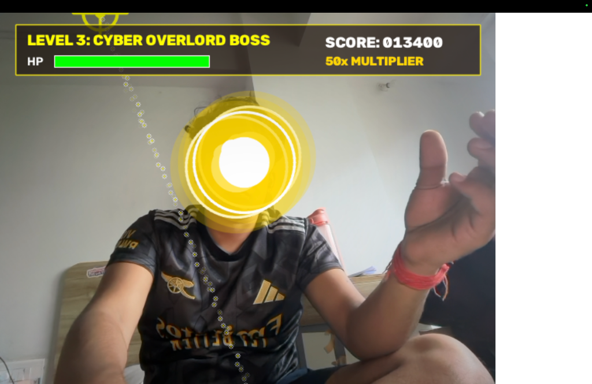
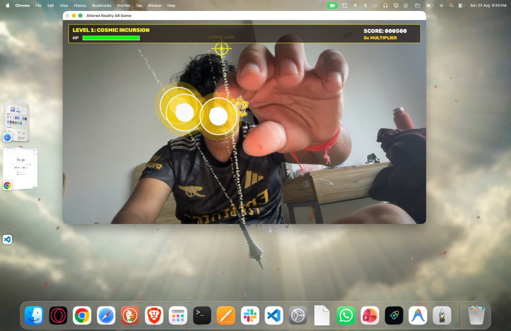
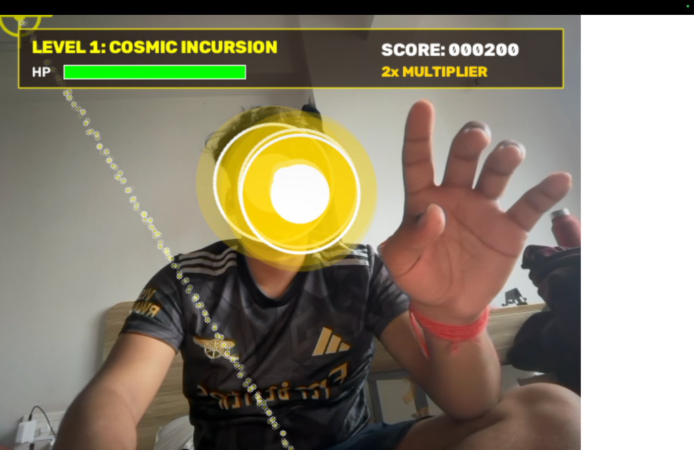

# 🌌 Altered Reality (AR) Webcam Action Game

A real-time **Augmented Reality (AR) Computer Vision Game** built in Python that turns your live webcam video feed into an interactive sci-fi battleground! Destroy flying 3D-styled anomaly orbs using your hand gestures, pointer reticle, and voice commands.

---

## 📸 Screenshots & Showcase

| Gameplay Action & Target Scope | Boss Battle & Level Progression |
|:------------------------------:|:------------------------------:|
|  |  |

| Hand Gesture Laser Targeting |
|:----------------------------:|
|  |

---

## 🔥 Key Features

- **🎥 Live Augmented Reality Feed**: Rendered over your room's webcam feed with zero-latency 60 FPS performance.
- **🖐️ Hand Gesture & Pointer Controls**:
  - **Auto-Aim Scope Reticle**: Reticle tracks 1-to-1 with your hand/fingertip across the camera view.
  - **Pinch / Tap Kill**: Pinching your thumb and finger or tapping fires a plasma laser beam that destroys anomaly orbs instantly.
- **🎙️ Non-Blocking Voice Commands**:
  - Say `"Shield"` / `"Protect"` -> Activates invulnerability forcefield.
  - Say `"Freeze"` / `"Stasis"` -> Locks all active screen enemies in ice crystals.
  - Say `"Nuke"` / `"Boom"` -> Triggers screen-shattering ultimate explosion.
- **✨ Volumetric AR Visuals & Graphics**:
  - Multi-layer refraction light orbs with ambient outer glowing auras and specular reflections.
  - Cinematic lens vignetting and screen shake physics on heavy impacts.
  - Translucent frosted glass HUD bar displaying Score, Health, Multipliers, and Status Badges.
- **🔊 Procedural Synthesized Audio**:
  - Sound effects (Laser blasts, Punch thumps, Shield hums, Freeze chimes) generated programmatically using `pygame.mixer` & NumPy without requiring external audio assets.
- **🏆 Progressive Levels**:
  - *Level 1: Cosmic Incursion* (Plasma Drones)
  - *Level 2: Elemental Tempest* (Fast hazard orbs)
  - *Level 3: Cyber Overlord Boss* (Boss Overlord fight)

---

## 🛠️ Installation & Setup

1. **Clone the Repository**:
```bash
git clone https://github.com/siddhantthakur278-bit/altered-reality-ar-game.git
cd altered-reality-ar-game
```

2. **Create Virtual Environment & Install Dependencies**:
```bash
python3 -m venv venv
source venv/bin/activate
pip install opencv-python numpy pygame-ce SpeechRecognition
```

3. **Run the Game**:
```bash
python3 main.py
```

---

## 🕹️ Controls Guide

| Input Method | Action / Effect |
| :--- | :--- |
| **Move Hand / Pointer** | Aims Holographic Scope Reticle (`[TARGET LOCK]`) |
| **Pinch / Click** | Fires Plasma Laser Beam (`FIRE!`) |
| **Voice: "Shield"** | 5s Invulnerability Forcefield |
| **Voice: "Freeze"** | 5s Stasis Ice Crystal Freeze |
| **Voice: "Nuke"** | Screen-Wide Ultimate Explosion |
| **Key `S`** | Forcefield Shield (Fallback) |
| **Key `F`** | Stasis Freeze (Fallback) |
| **Key `N`** | Screen Nuke (Fallback) |
| **Key `R`** | Restart Game |
| **Key `Q` / `ESC`** | Quit Game |

---

## 📄 License
This project is open-source under the MIT License.
